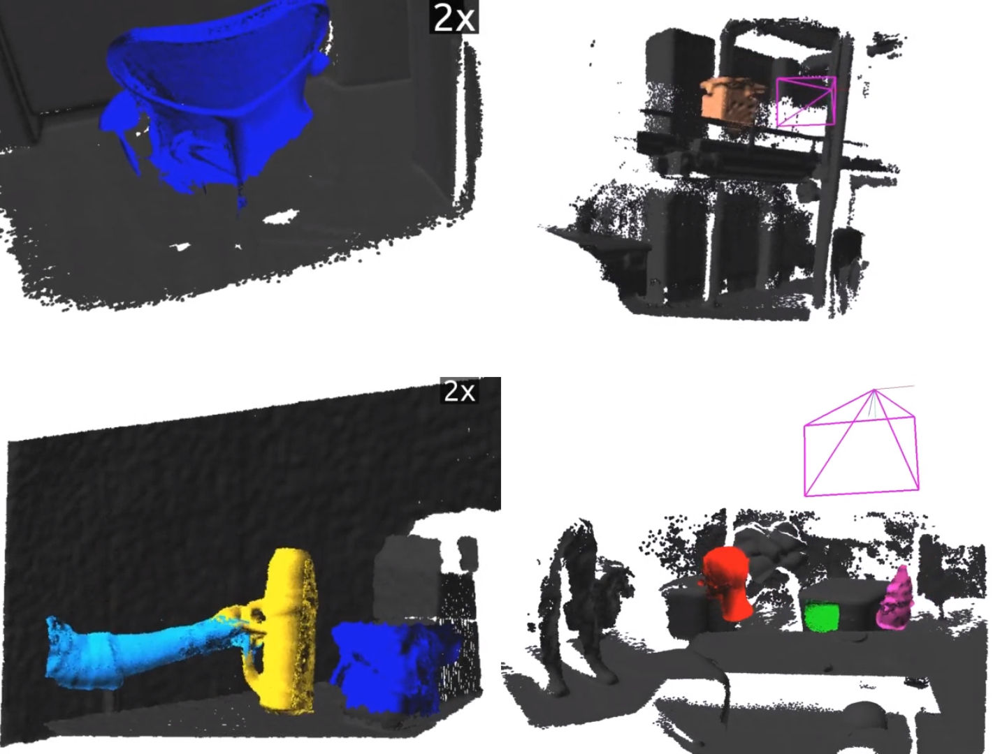

# Co-Fusion

This repository contains Co-Fusion, a dense SLAM system that takes a live stream of RGB-D images as input and segments the scene into different objects.

Crucially, we use a multiple model fitting approach where each object can move independently from the background and still be effectively tracked and its shape fused over time using only the information from pixels associated with that object label. Previous attempts to deal with dynamic scenes have typically considered moving regions as outliers that are of no interest to the robot, and consequently do not model their shape or track their motion over time. In contrast, we enable the robot to maintain 3D models for each of the segmented objects and to improve them over time through fusion. As a result, our system has the benefit to enable a robot to maintain a scene description at the object level which has the potential to allow interactions with its working environment; even in the case of dynamic scenes.

To run Co-Fusion in real-time, you have to use our approach based no motion cues. If you prefer to use semantic cues for segmentation, please pre-process the segmentation in advance and feed the resulting segmentation masks into Co-Fusion.

More information and the paper can be found [here](http://visual.cs.ucl.ac.uk/pubs/cofusion/index.html).

If you would like to see a short video comparing ElasticFusion and Co-Fusion, click on the following image:

## Publication

Please cite this publication, when using Co-Fusion (bibtex can be found on project webpage):

* Co-Fusion: **Real-time Segmentation, Tracking and Fusion of Multiple Objects**, Martin Rünz and Lourdes Agapito, 2017 IEEE International Conference on Robotics and Automation (ICRA)

## Building Co-Fusion

The script `Scripts/install.sh` shows step-by-step how Co-Fusion is build. A python-based install script is also available, see `Scripts\install.py`.

## Dataset and evaluation tools

We are going to release testing-data and dataset tools after coming back from ICRA (June 2017). Stay tuned!

## Reformatting code:
The code-formatting rules for this project are defined `.clang-format`. Run:

    clang-format -i -style=file Core/**/*.cpp Core/**/*.h Core/**/*.hpp GUI/**/*.cpp GUI/**/*.h GUI/**/*.hpp

## ElasticFusion
The overall architecture and terminal-interface of Co-Fusion is based on [ElasticFusion](https://github.com/mp3guy/ElasticFusion) and the ElasticFusion [readme file](https://github.com/mp3guy/ElasticFusion/blob/master/README.md) contains further useful information.
